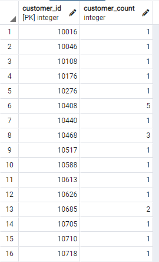
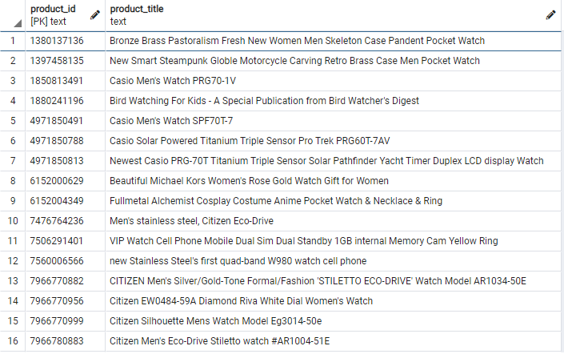
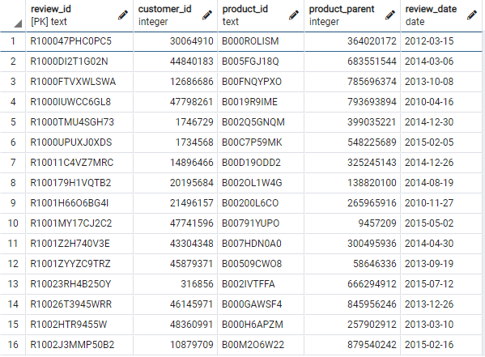
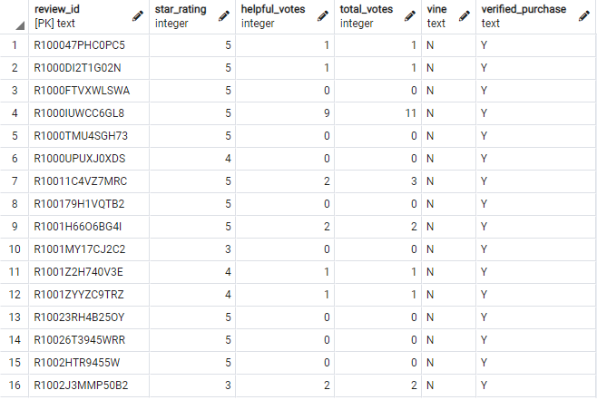
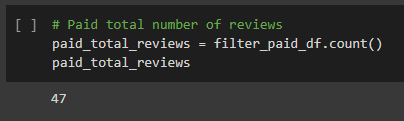
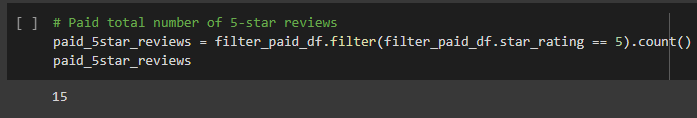
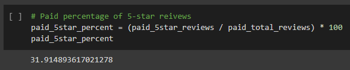
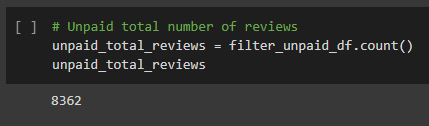
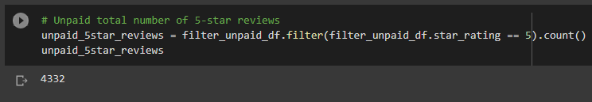
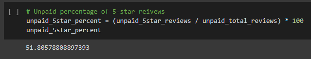

# Amazon Vine Analysis

### Overview
In this project, we’ll have access to approximately 50 datasets. Each one contains reviews of a specific product, from clothing apparel to wireless products. We will pick one of these datasets and use PySpark to perform the ETL process to extract the dataset, transform the data, connect to an AWS RDS instance, and load the transformed data into pgAdmin. Afterwhich, we'll use PySpark, Pandas, or SQL to determine if there is any bias toward favorable reviews from Vine members in your dataset. In this project, we will be focusing on Amazon reviews of watches.

### Resources
#### Dataset: Amazon Watches Reviews
https://s3.amazonaws.com/amazon-reviews-pds/tsv/amazon_reviews_us_Watches_v1_00.tsv.gz

[Amazon_Reviews_ETL.ipynb](Amazon_Reviews_ETL.ipynb)

[Vine_Review_Analysis.ipynb](Vine_Review_Analysis.ipynb)

### Results
#### Deliverable 1: Perform ETL on Amazon Watches Reviews
* Amazon Review of dataset is extracted as a DataFrame:

    [Resources/Amazon_Reviews_ETL.ipynb.pdf](Amazon_Reviews_ETL.ipynb.pdf)

* Extracted dataset is transformed into 4 DataFrames with correct columns:

    [Resources/Amazon_Reviews_ETL.ipynb.pdf](Amazon_Reviews_ETL.ipynb.pdf)

* 4 DataFrames are loaded into pgAdmin:

#### Deliverable 2: Determine Bias of Vine Reviews
* PySpark method was used:

    [Vine_Review_Analysis.ipynb](Vine_Review_Analysis.ipynb)

* Data is filtered to create a DataFrame where there are 20+ total votes:

    [Vine_Review_Analysis.ipynb](Vine_Review_Analysis.ipynb) (Cell 4)    

* Data is filtered to create a DataFrame where percentage of helpful_votes is >= 50%:
    
    [Vine_Review_Analysis.ipynb](Vine_Review_Analysis.ipynb) (Cell 5)
    
* Data is filtered where there is a Vine review:

    [Vine_Review_Analysis.ipynb](Vine_Review_Analysis.ipynb) (Cell 6)
    
* Data is filtered where there is no Vine review:

    [Vine_Review_Analysis.ipynb](Vine_Review_Analysis.ipynb) (Cell 7)

* The total number of reviews, the number of 5-star reviews, and the percentage 5-star reviews are calculated for all Vine and non-Vine reviews:
##### Vine

##### Non-Vine

### Summary
Based on the results from the analysis of the Amazon Watches reviews, it was determined that 32% of the reviews in the Vine program were 5-stars reviews. However, examining the results of the percentage in the non-Vine reviews yeilded a surprising 52% 5-star reviews. This result describes that there is no bias for reviews in the Vine program. On area that we could futher analyze is the statistical distribution (i.e.: mean, median and mode) of all the star ratings for the Vine program vs. the Non-Vine.
